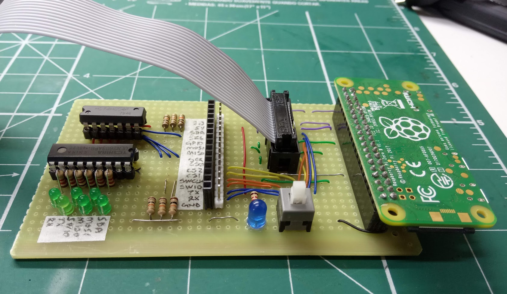
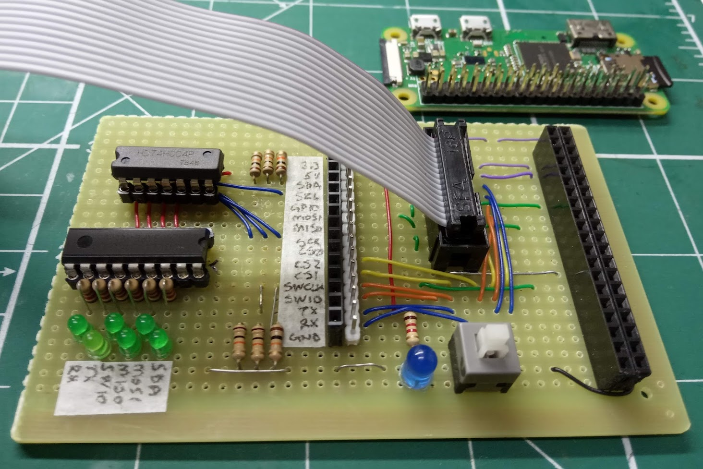
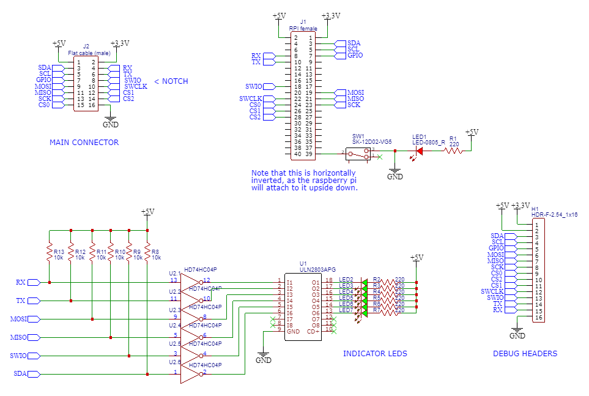

# Fortuna Connector

This is a connector that plugs a Raspberry Pi to a board, and can be used to:
 - Have a Raspberry Pi programming multiple microcontroller types in the board (AVR, ARM, etc.)
 - Debug protocols in the board using the Raspberry Pi (UART, SPI, I²C, SWD)

The connector contains:
 - A female header to connect to the Raspberry Pi GPIOs
 - A male header to connect the Raspberry Pi to the board using a flat cable.
 - A male and female header to help debug any problems in communication (for example, using a digital analyzer)
 - LEDs indicating activity in the protocols.

## Photos

With the Raspberry Pi attached

## Main connector pinout

Left side

| Pin | Type  | Classification | Pin in RPI | # pin in RPI |
|-----|-------|----------------|------------|--------------|
|  1  | 5V    | Power          | 5V         | 2, 4  |
|  3  | SDA   | I²C            | SDA        | 3     |
|  5  | SCL   | I²C            | SCL        | 5     |
|  7  | GPIO  | GPIO           | GPIO4      | 7     |
|  9  | MOSI  | SPI            | MOSI       | 19    |
| 11  | MISO  | SPI            | MISO       | 21    |
| 13  | SCK   | SPI            | SCK        | 23    |
| 15  | CS0   | SPI            | CE0        | 24    |

Right side (notch)

| Pin | Type  | Classification | Pin in RPI | # pin in RPI |
|-----|-------|----------------|------------|--------------|
|  2  | 3.3V  | Power          | 3.3V       | 1, 17 |
|  4  | RX    | Serial         | TXD        | 10    |
|  6  | TX    | Serial         | RDX        | 8     |
|  8  | SWIO  | SWD            | GPIO24     | 18    |
| 10  | SWCLK | SWD            | GPIO25     | 22    |
| 12  | CS1   | SPI            | CE1        | 26    |
| 14  | CS2   | SPI            | GPIO28     | 28    |
| 16  | GND   | Power          | GND        | 6, 9, 14, 25, 30, 34, 39 |

`GPIO` can be used as a generic pin to get information from the board to the PI or vice-versa. `CS0`, `CS1` and `CS2` can be used to activate SPI on either side, or as generic pins.

## Schematic

